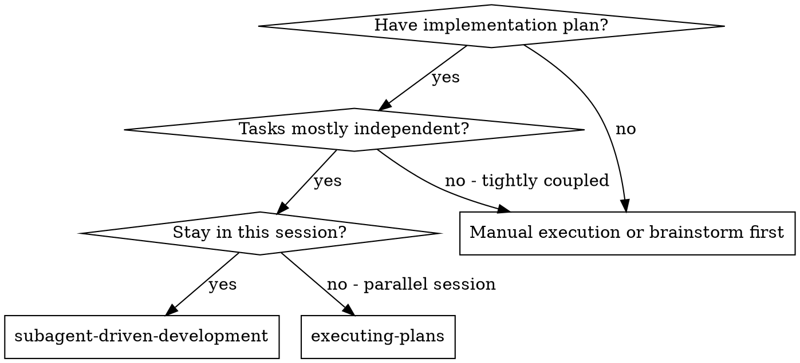
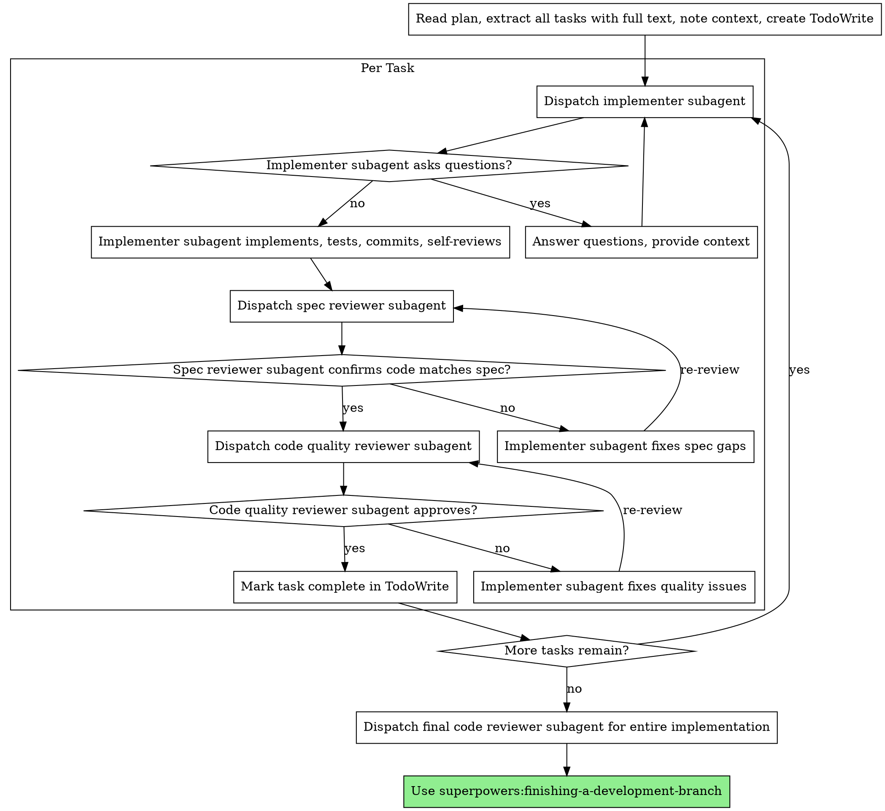

# Subagent-Driven Development

Execute plan by dispatching fresh subagent per task, with two-stage review after each: spec compliance review first, then code quality review.

**Why subagents:** You delegate tasks to specialized agents with isolated context. By precisely crafting their instructions and context, you ensure they stay focused and succeed at their task. They should never inherit your session's context or history — you construct exactly what they need. This also preserves your own context for coordination work.

**Core principle:** Fresh subagent per task + two-stage review (spec then quality) = high quality, fast iteration

---

## Trigger Conditions

- Have a clear implementation plan
- Tasks are mostly independent
- Want to stay in same session (no handoff)
- Need spec compliance + code quality reviews

---

## When to Use



**vs. Executing Plans (parallel session):**
- Same session (no context switch)
- Fresh subagent per task (no context pollution)
- Two-stage review after each task: spec compliance first, then code quality
- Faster iteration (no human-in-loop between tasks)

---

## External Resources

| File Path | Purpose |
|---|---|
| `@/Users/leyixu/.claude/skills/subagent-driven-development/implementer-prompt.md` | Implementer subagent prompt template |
| `@/Users/leyixu/.claude/skills/subagent-driven-development/spec-reviewer-prompt.md` | Spec reviewer subagent prompt template |
| `@/Users/leyixu/.claude/skills/subagent-driven-development/code-quality-reviewer-prompt.md` | Code quality reviewer subagent prompt template |

---

## The Process



---

## Model Selection

Use the least powerful model that can handle each role to conserve cost and increase speed.

**Mechanical implementation tasks** (isolated functions, clear specs, 1-2 files): use a fast, cheap model. Most implementation tasks are mechanical when the plan is well-specified.

**Integration and judgment tasks** (multi-file coordination, pattern matching, debugging): use a standard model.

**Architecture, design, and review tasks**: use the most capable available model.

**Task complexity signals:**
- Touches 1-2 files with a complete spec → cheap model
- Touches multiple files with integration concerns → standard model
- Requires design judgment or broad codebase understanding → most capable model

---

## Handling Implementer Status

Implementer subagents report one of four statuses. Handle each appropriately:

**DONE:** Proceed to spec compliance review.

**DONE_WITH_CONCERNS:** The implementer completed the work but flagged doubts. Read the concerns before proceeding. If the concerns are about correctness or scope, address them before review. If they're observations (e.g., "this file is getting large"), note them and proceed to review.

**NEEDS_CONTEXT:** The implementer needs information that wasn't provided. Provide the missing context and re-dispatch.

**BLOCKED:** The implementer cannot complete the task. Assess the blocker:
1. If it's a context problem, provide more context and re-dispatch with the same model
2. If the task requires more reasoning, re-dispatch with a more capable model
3. If the task is too large, break it into smaller pieces
4. If the plan itself is wrong, escalate to the human

**Never** ignore an escalation or force the same model to retry without changes. If the implementer said it's stuck, something needs to change.

---

## Prompt Templates

> **Note**: Use the files from `@/Users/leyixu/.claude/skills/subagent-driven-development/`

- `implementer-prompt.md` - Dispatch implementer subagent
- `spec-reviewer-prompt.md` - Dispatch spec compliance reviewer subagent
- `code-quality-reviewer-prompt.md` - Dispatch code quality reviewer subagent

---

## Example Workflow

```
You: I'm using Subagent-Driven Development to execute this plan.

[Read plan file once: docs/superpowers/plans/feature-plan.md]
[Extract all 5 tasks with full text and context]
[Create TodoWrite with all tasks]

Task 1: Hook installation script

[Get Task 1 text and context (already extracted)]
[Dispatch implementation subagent with full task text + context]

Implementer: "Before I begin - should the hook be installed at user or system level?"

You: "User level (~/.config/superpowers/hooks/)"

Implementer: "Got it. Implementing now..."
[Later] Implementer:
  - Implemented install-hook command
  - Added tests, 5/5 passing
  - Self-review: Found I missed --force flag, added it
  - Committed

[Dispatch spec compliance reviewer]
Spec reviewer: ✅ Spec compliant - all requirements met, nothing extra

[Get git SHAs, dispatch code quality reviewer]
Code reviewer: Strengths: Good test coverage, clean. Issues: None. Approved.

[Mark Task 1 complete]

Task 2: Recovery modes

[Get Task 2 text and context (already extracted)]
[Dispatch implementation subagent with full task text + context]

Implementer: [No questions, proceeds]
Implementer:
  - Added verify/repair modes
  - 8/8 tests passing
  - Self-review: All good
  - Committed

[Dispatch spec compliance reviewer]
Spec reviewer: ❌ Issues:
  - Missing: Progress reporting (spec says "report every 100 items")
  - Extra: Added --json flag (not requested)

[Implementer fixes issues]
Implementer: Removed --json flag, added progress reporting

[Spec reviewer reviews again]
Spec reviewer: ✅ Spec compliant now

[Dispatch code quality reviewer]
Code reviewer: Strengths: Solid. Issues (Important): Magic number (100)

[Implementer fixes]
Implementer: Extracted PROGRESS_INTERVAL constant

[Code reviewer reviews again]
Code reviewer: ✅ Approved

[Mark Task 2 complete]

...

[After all tasks]
[Dispatch final code-reviewer]
Final reviewer: All requirements met, ready to merge

Done!
```

---

## Advantages

**vs. Manual execution:**
- Subagents follow TDD naturally
- Fresh context per task (no confusion)
- Parallel-safe (subagents don't interfere)
- Subagent can ask questions (before AND during work)

**vs. Executing Plans:**
- Same session (no handoff)
- Continuous progress (no waiting)
- Review checkpoints automatic

**Efficiency gains:**
- No file reading overhead (controller provides full text)
- Controller curates exactly what context is needed
- Subagent gets complete information upfront
- Questions surfaced before work begins (not after)

**Quality gates:**
- Self-review catches issues before handoff
- Two-stage review: spec compliance, then code quality
- Review loops ensure fixes actually work
- Spec compliance prevents over/under-building
- Code quality ensures implementation is well-built

**Cost:**
- More subagent invocations (implementer + 2 reviewers per task)
- Controller does more prep work (extracting all tasks upfront)
- Review loops add iterations
- But catches issues early (cheaper than debugging later)

---

## ⚠️ Gotchas (Red Flags & Common Pitfalls)

### Pitfall 1: Wrong Review Order
- **Trap**: Starting code quality review before spec compliance is confirmed ✅
- **Consequence**: Wasting time reviewing code that doesn't meet requirements
- **Solution**: Always complete spec compliance review first, then code quality review

### Pitfall 2: Skipping Review Loops
- **Trap**: Moving to next task when reviewer found issues
- **Consequence**: Issues never get fixed; technical debt accumulates
- **Solution**: Reviewer found issues → Implementer fixes → Reviewer reviews again → Repeat until approved

### Pitfall 3: Parallel Implementation Subagents
- **Trap**: Dispatching multiple implementation subagents simultaneously
- **Consequence**: Merge conflicts, overlapping changes, inconsistent state
- **Solution**: One implementer subagent at a time; complete review cycle before next task

### Pitfall 4: Making Subagent Read Plan File
- **Trap**: Giving subagent a file path instead of full task text
- **Consequence**: Subagent has to read file, adds latency, may misinterpret
- **Solution**: Controller reads plan once, extracts all tasks, provides full text to subagents

### Pitfall 5: Ignoring Subagent Questions
- **Trap**: Rushing subagent into implementation without answering their questions
- **Consequence**: Subagent makes assumptions, produces wrong output
- **Solution**: Answer all questions clearly before letting subagent proceed

### Pitfall 6: Starting on Main/Master Without Consent
- **Trap**: Beginning implementation on production branch without explicit user approval
- **Consequence**: Risk of breaking production, unreviewed code in mainline
- **Solution**: Always use git worktrees or feature branches; ask user before touching main/master

### Pitfall 7: Accepting "Close Enough" on Spec Compliance
- **Trap**: Spec reviewer found issues, but you think they're minor
- **Consequence**: Spec drift, missing requirements, scope creep
- **Solution**: Spec reviewer found issues = not done. Must fix before proceeding.

### Pitfall 8: Self-Review Replacing Actual Review
- **Trap**: Trusting implementer's self-review and skipping formal reviews
- **Consequence**: Blind spots, missed issues, lower quality
- **Solution**: Self-review catches some issues; formal reviews catch different issues. Both are needed.

---

## Integration

**Required workflow skills:**
- **superpowers:using-git-worktrees** - REQUIRED: Set up isolated workspace before starting
- **superpowers:writing-plans** - Creates the plan this skill executes
- **superpowers:requesting-code-review** - Code review template for reviewer subagents
- **superpowers:finishing-a-development-branch** - Complete development after all tasks

**Subagents should use:**
- **superpowers:test-driven-development** - Subagents follow TDD for each task

**Alternative workflow:**
- **superpowers:executing-plans** - Use for parallel session instead of same-session execution

---

## Fallback Strategies

### When subagent is BLOCKED
1. **Context problem** → Provide more context, re-dispatch with same model
2. **Reasoning problem** → Re-dispatch with more capable model
3. **Task too large** → Break into smaller subtasks
4. **Plan is wrong** → Escalate to human

### When review cycles take too long
- Check if spec is unclear (source of repeated rejections)
- Consider if task boundaries are wrong
- May need to escalate to human for plan revision

### When subagent keeps asking questions
- Review your initial prompt clarity
- Ensure you're providing sufficient context upfront
- Consider if task is well-scoped

---

## Testing Recommendations

Suggested eval scenarios (create evals/evals.json):

```json
{
  "evals": [
    {
      "name": "basic-task-execution",
      "prompt": "Execute a 3-task plan for adding user authentication",
      "expected": "Complete all tasks with spec compliance and code quality reviews"
    },
    {
      "name": "blocked-subagent-handling",
      "prompt": "Subagent reports BLOCKED due to unclear requirements",
      "expected": "Provide more context or escalate to human appropriately"
    },
    {
      "name": "review-loop-adherence",
      "prompt": "Spec reviewer finds issues in implementation",
      "expected": "Implementer fixes issues, reviewer re-reviews, loop until approved"
    }
  ]
}
```

---

## Summary

Core loop:

1. Read plan, extract tasks
2. For each task:
   - Dispatch implementer subagent
   - Answer questions
   - Implement, test, commit
   - Spec compliance review (must pass ✅)
   - Code quality review (must pass ✅)
   - Mark complete
3. Final review of entire implementation
4. Finish development branch

Remember: Fresh subagent per task + two-stage review = high quality, fast iteration
